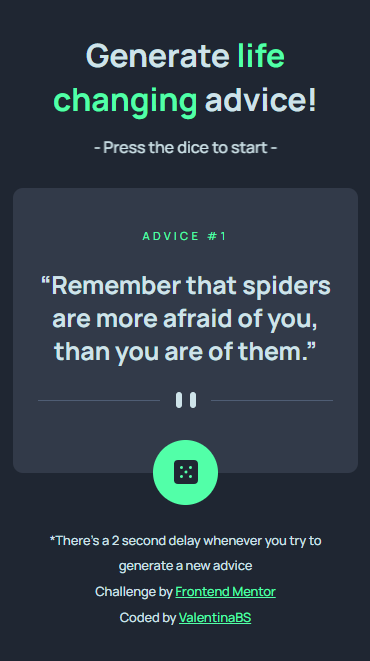

# Frontend Mentor - Advice generator app solution

This is a solution to the [Advice generator app challenge on Frontend Mentor](https://www.frontendmentor.io/challenges/advice-generator-app-QdUG-13db). This time, including the [Advice Slip API](https://api.adviceslip.com/)!

## Table of contents

- [Overview](#overview)
  - [The challenge](#the-challenge)
  - [Screenshots](#screenshots)
  - [Links](#links)
- [My process](#my-process)
  - [Built with](#built-with)
  - [Useful resources](#useful-resources)
- [Author](#author)

## Overview

### The challenge

Users should be able to:

- View the optimal layout for the app depending on their device's screen size
- See hover states for all interactive elements on the page
- Generate a new piece of advice by clicking the dice icon

### Screenshots

My results (responsiveness included!) 

Project preview

### Links

- Solution URL: [Solution in Frontend Mentor]()
- Live Site URL: [Vercel Deploy]()

## My process

### Built with

- Semantic HTML5 markup
- CSS custom properties
- Flexbox
- JavaScript
- Mobile-first workflow
- [Advice Slip API](https://api.adviceslip.com/)

### Useful resources

- [The <q> element](https://developer.mozilla.org/en-US/docs/Web/HTML/Element/q) - This helped me discover an HTML tag I didn't know. I really liked this element, since it allowed me to work with the quotes, without having to add a span element to include the quotation marks.
- [Decorative images](https://www.w3.org/WAI/tutorials/images/decorative/) - This is an amazing article which helped me understand the types of images one can use in a page. It's very important to specify an empty alt attribute to a decorative image.

## Author

- Frontend Mentor - [@ValentinaBS](https://www.frontendmentor.io/profile/ValentinaBS)
- Github - [@ValentinaBS](https://github.com/ValentinaBS)